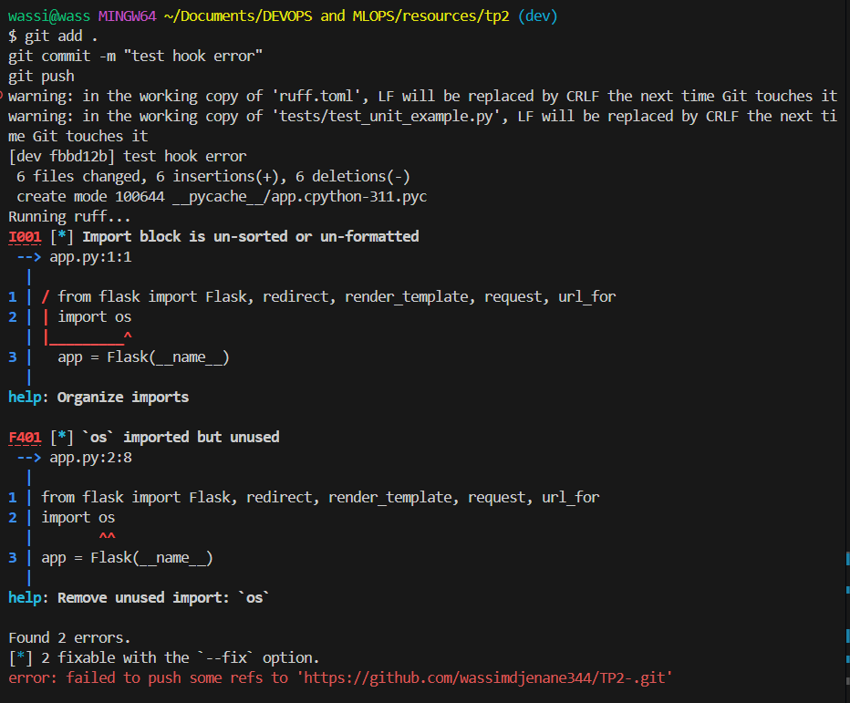
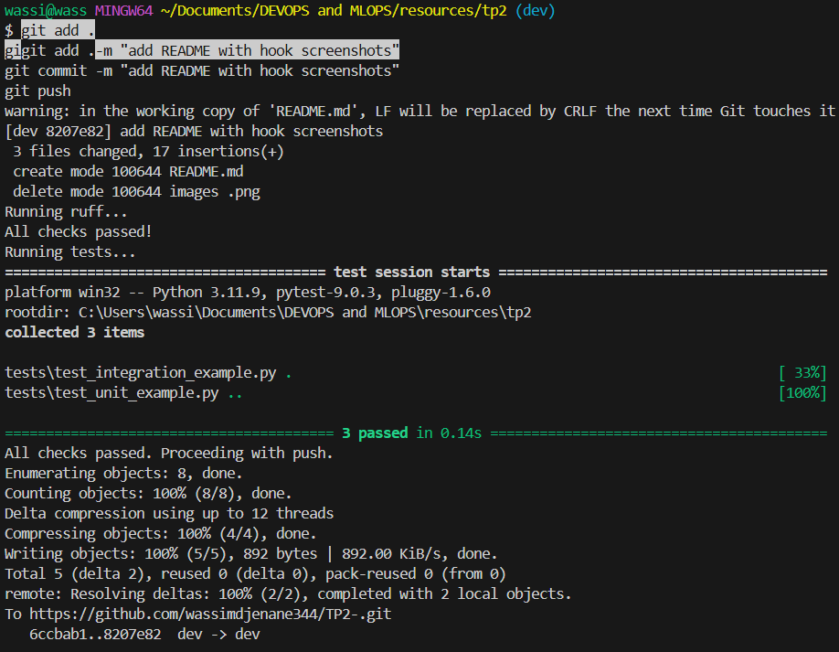

# TP2 - Linting, Testing & Git Hooks

## Git Hook pre-push

Le hook bloque automatiquement le `git push` si ruff ou pytest détecte une erreur.

### Push bloqué (erreurs ruff)

Ruff a détecté 2 erreurs : un import inutilisé (`os`) et des imports mal triés. Le push est annulé.

### Push réussi (tout est propre)

Ruff passe, les 3 tests passent, le code est envoyé sur GitHub.
